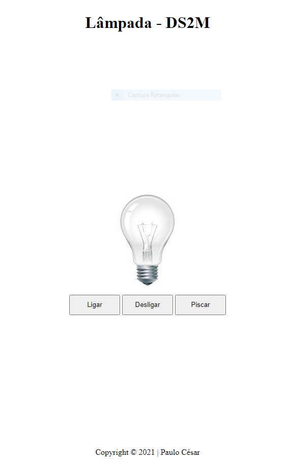

# Lâmpada - DS2M

Site criado com objetivos didáticos para as aulas de PWFE do curso de Desenvolvimento de Sistemas do [SENAI Jandira](https://jandira.sp.senai.br/).

O projeto consiste em criar uma lâmpada que tenha cinco ações, ligar, desligar, piscar, parar e quebrar, utilizando vários eventos.  

  

O código foi construido pensando em boas práticas, como responsabilidade única e funções puras.

